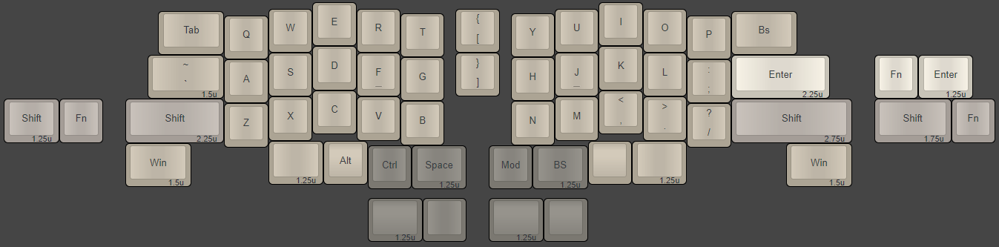
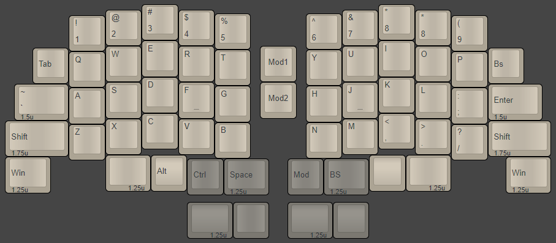

## Layouts

Here you can find a few of different variations of TeethLess keyboard.

Basicly "TeethLess" layout was based on idea of _"space in between keys, that reminds about space between teeth"_, but ended up being kinda friendly 40% layout for "new users" by using **50 keys**, instead of most popular 40-47 keys layouts.

> My guess, even if it's looks like 40% layout, we can call it 50% layout...

 

### v4

The v4 is the version which ended up being actually produced, and all the plates and schemas in this repository is made for this layout.

 

### v5

Trying to add changes to layout so it can be easier to cover with most of the Base keycap sets.

Not ever being produced, at least by me.

 

### v6 - "The Space Invader"

TeethLess65 Layout that was made for fun by trying to add the number-row for v4 layout...

